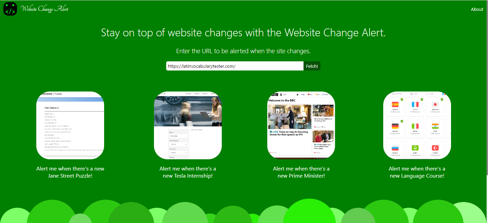

# Website Change Alert

An app to alert the user via email when a website changes in a particular way.

Some use cases include:
- Internship Applications --- Get notified when a company starts accepting applications.
- Puzzles --- Get notified when a new puzzle is released.
- News Updates -- Get news updates about a very particular topic which you find interesting by conditionally tracking a news website.

... and many more.

Each of these uses could of course easily be accomplished manually and individually, however when a user has many URLs to check and keep track of every day, it can be overwhelming. Having an automated service to do this for you gives peace of mind and saves time. 

## Feature Roadmap
0. [Fix up the code to make it more maintainable]
1. Support different time periods to check on.
2. Support apps rendered with client side JS such as React, e.g. through Puppeteer
3. Support conditional triggers so a new internship only causes an alert if it's in the UK, for example.
4. Allow users to login and save their details in order to save time when setting up alerts.
5. Allow users to delete alerts once they are setup (without needing to delve into the DB!).
6. Reduce the likelihood of emails going to Junk
7. Add a section detailing recent use cases of the app (not hard-coded), updating every time a user creates a new trigger.
8. Update the Database to cleanup once a change is noted to the site so that the triggers are reusable and not once-only.
9. Add a loading image to the iframe before it has loaded since it is slow on vercel; try to improve caching to speed up.
10. Support mobile devices with responsive design and PWA integration.
11. Add more ways to notify such as discord integration.

## Technical Details
- MongoDB, Express, React, Node.js (MERN Stack).
- Hosted on vercel with serverless functions for the backend.
- You can test with a serverful implementation using the code in the dev-server directory.
- We are using GitHub Actions to do the scheduled checks (roughly once per hour at the moment).
- To create your own version you would need to fork the repository and setup the MongoDB environment.
    - Populate the .env files in server, cronserver and common with the correct values, and also add these to the GitHub actions secrets for the repository
- (Server certs checked in for development - just basic selfsigned.)
